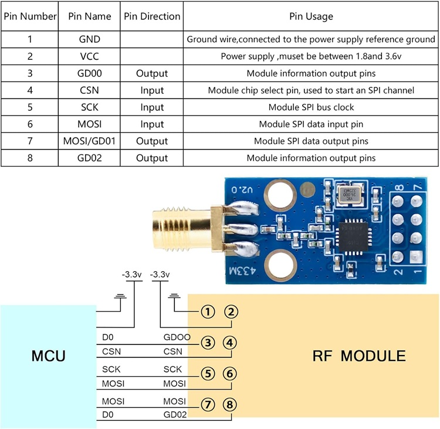

# Spécifications Techniques : Module Radio CC1101

Émetteur-récepteur RF haute performance conçu pour les applications sans fil à ultra-faible puissance.

[amazon.fr](https://www.amazon.fr/dp/B0DKNVPQDK?ref_=ppx_hzsearch_conn_dt_b_fed_asin_title_1)

## 🛠 Caractéristiques Électriques

| Attribut | Valeur |
| :--- | :--- |
| **Tension de fonctionnement** | 1.8V ~ 3.6V |
| **Courant de fonctionnement max** | 30 mA (à +10 dBm) |
| **Interface de commande** | Bus SPI (Standard) |
| **Température de service** | -40°C à +85°C |
| **Consommation en veille** | < 1 µA (Sleep mode) |

## 📈 Performances Radio

- **Plages de fréquences :** 300-348 MHz, 387-464 MHz, 779-928 MHz.
- **Fréquences optimisées :** 433 MHz et 868 MHz.
- **Puissance de sortie max :** +10 dBm (ajustable par logiciel).
- **Sensibilité :** Jusqu'à -110 dBm (selon le débit de données).
- **Débit de données :** Ajustable de 1.2 kbps à 500 kbps.
- **Modulations supportées :** 2-FSK, GFSK, MSK, ASK, OOK.

## 🔌 Brochage (Pinout)

| Pin | Fonction | Description |
| :--- | :--- | :--- |
| **VCC** | Alimentation | Entrée 3.3V (Typique) |
| **GND** | Masse | Référence 0V |
| **SI** | MOSI | Entrée de données SPI |
| **SO (GDO1)** | MISO | Sortie de données SPI / Sortie numérique |
| **SCK** | SCLK | Horloge du bus SPI |
| **CSN** | CS / SS | Sélection de puce (Chip Select) |
| **GDO0** | Digital Out | Sortie de signal de données / Synchro |
| **GDO2** | Digital Out | Sortie de signal de contrôle |

## 📡 Antenne & Transmission

- **Type d'antenne :** Externe (souvent fournie en format "ressort" ou SMA).
- **Support Multi-Canaux :** Permet le saut de fréquence (Frequency Hopping).
- **Fonctions intégrées :** Gestionnaire de paquets, détection d'adresse, support des préambules et CRC.
