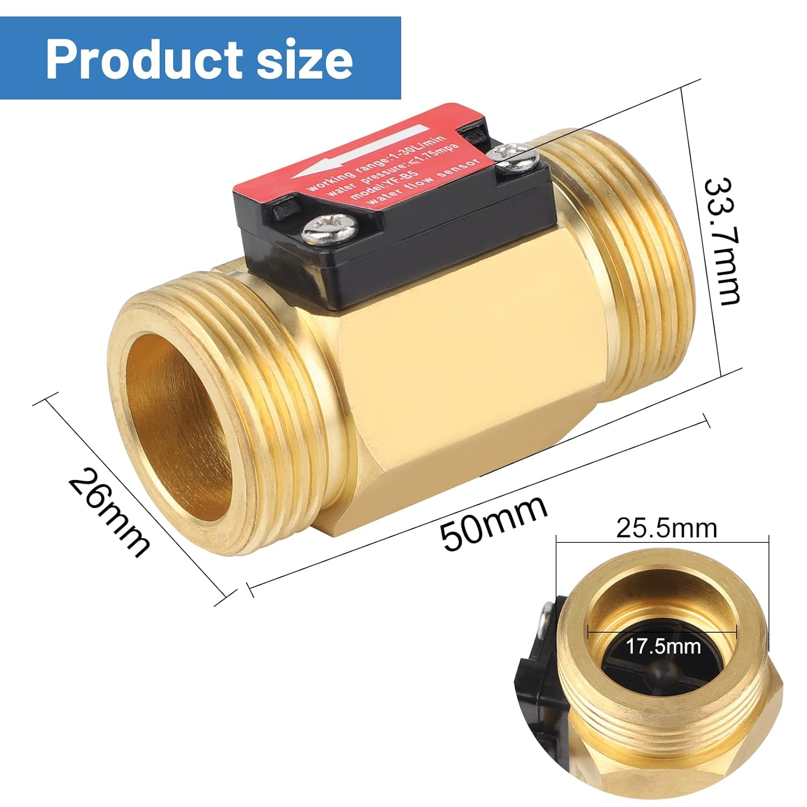

# Spécifications Techniques : Débitmètre

Capteur de débit d'eau en laiton avec capteur à effet Hall intégré.

[amazon.fr](https://www.amazon.fr/SWAWIS-Pi%C3%A8ces-Capteur-D%C3%A9bitm%C3%A8tre-Commutateur/dp/B0C2GT6LHY)

## 🛠 Caractéristiques Physiques & Électriques
| Attribut | Valeur |
| :--- | :--- |
| **Type de signal** | Impulsion NPN (Collecteur ouvert) |
| **Matériau** | Laiton H57 |
| **Filetage** | G 1/2" (DN15) |
| **Tension d'entrée (VCC)** | DC 5V à 15V |
| **Consommation max** | 15 mA (sous 5V) |
| **Pression de service** | ≤ 1.75 MPa (17.5 bars) |
| **Température liquide** | < 120°C |

## 📈 Métrologie
- **Plage de mesure :** 1 ~ 30 L/min
- **Précision :** ± 3%
- **Formule de fréquence :** $f (Hz) = 6.6 \times Q (L/min)$
- **Ratio d'impulsions :** ~396 impulsions / Litre
- **Volume par impulsion :** 0,002525 Litres (2,52 ml)
- **Cycle de service :** 50% ± 10%

## 🔌 Schéma de Câblage
| Couleur | Fonction | Branchement ESP32 |
| :--- | :--- | :--- |
| **Rouge** | VCC (+) | Borne 5V (VIN) |
| **Noir** | GND (-) | Borne GND |
| **Jaune** | Signal (S) | GPIO (ex: GPIO4) avec `INPUT_PULLUP` |

## ⚙️ Configuration ESPHome (Résumé)
- **Platform :** `pulse_meter`
- **Internal Filter :** 10ms à 13ms recommandé
- **Multiplicateur (L/min) :** `0.002525`
- **Multiplicateur (m³) :** `0.000002525`
